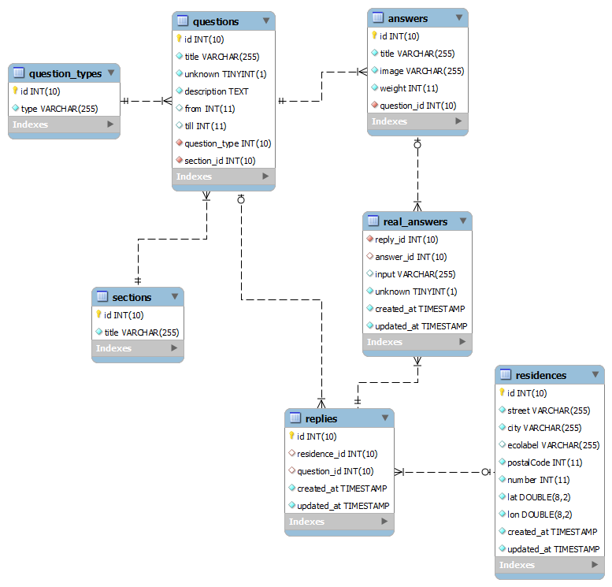

Leiedal plong: Manual
=====================================

## Database Schema
---

### Residences

All residences that users have submitted to the application are stored here.

**id:** id in the database  
**street:** Streetname of the residence  
**city:** City of the residence  
**ecolabel:** Calculated ecolabel (NYI)  
**postalCode:** Postal code of the residence  
**number:** House number  
**lat:** Latitude coordinate  
**long:** Longitude coordinate  

### Questions

This table contains all the questions that are used in the application. They are asked in the same order as they are in the database.

**id:** id in the database  
**title:** Title of the question, used as an identifier for images that can be added to the house on the Questionnaire  
**unknown:** Defines if the question has the "I don't know"-option (NYI)  
**description:** How the question is formulated to the user  
**from:** If the question has a range option, define starting range (not used)  
**till:** If the question has a range option, define ending range (not used)  
**question_type:** The question type ('yes_no', 'button', 'slider', 'input', 'multi')  
**section_id:** The section the question belongs to ('Gebouw', 'Isolatie', 'Wonen')  

### Answers 

This table contains all possible answers linked to their corresponding questions.

**id:** id in the database  
**title:** How the answer is formulated to the user  
**image:** 'y' or 'n', if 'y', then the application will attempt to load an image based on Question title combined with the answer order (for example: s1-basement1.svg and s1-basement2.svg for for the first and second possible basement answers)  
**weight:** The weight of the answer corresponding to the ecolabel

### Replies

This table is where all residences are linked to their individual questions which they answered.  
It contains a reference to a Residence (id) and a Question (id)

### Real_answers

This table contains the link between which answers a user has defined for any given residence. They are linked together by reply_id and answer_id.  

**input:** If the answer has a possible user input (not a standard answer, for example: the building year if you were to use a slider, this field would then contain '1987', or whatever the user submitted)

### Question_types

This table contains the various question types: 'yes_no', 'button', 'slider', 'input', 'multi'

### Sections

This table contains the various sections: 'Gebouw', 'Isolatie', 'Wonen'

## Adding your own questions/answers

---

Currently there is no real dashboard to configure the application, so all questions and answers have to be added manually, through seeding, or by inserting them in the database yourself.  
Note that altering the answers and questions will make the current responses void, so make a database back-up if you want to retain this information.

It is advised to just re-seed your database if you want to add or change questions with following command:

    php artisan db:seed

Questions and answers added via seeding can be found in **storage/app/questions.json**.  
The questions are asked in the questionnaire in the order in which they are in the database, and thus, this file. So add them at the correct position.

    Example question + answers
    
    {
      "title": "basement",    // Used to identify the image
      "unknown": 1,           // Does the question have an "I don't know"-answer (NYI)
      "description": "Heeft u een kelder?", // Formulation to the user
      "from": null,           // Starting range (eg. 1850)
      "till": null,           // Ending range (eg. 2015)
      "type": 2,              // Type of question, by id (yes_no, button, slider, 'input', 'multi', respectively 1 - 5)
      "answers": [
        {
          "title": "Ja",      // Answer as shown to the user
          "image": "y",       // Does the answer have a corresponding image (y or n)
          "weight": 3         // Weight, regarding the ecolabel
        },
        {
          "title": "Nee",
          "image": "y",
          "weight": 1
        }
      ]
    }

### Adding images

In the current iteration of the application, you can easily add extra images if they are not altered by the amount of floors in the house (anything not related to the roof basically).  
The names of these images are a combination of a prefex, the question title (eg. 'basement') and the answer number (1 and 2 in our example) 

All images have the prefix s1, so that's how we start. If the floors don't matter, then this is followed by a '-' and the title of the question (in our example basement), following by the number of the answer (1 or 2) and the file extension (.svg)

So in our example, the answer images would be formulated as following:

    "Ja":  public/assets/s1-basement1.svg
    "Nee": public/assets/s1-basement2.svg
    
Some questions, such as the roof have answers depending on the amount of floors a house has. In these cases, the prefix (s1) is adjusted.  
In **public/js/app.js** there is a directive which is used to "draw" the house.  
This is the section that works the magic:

    restrict: 'A',
    scope: {
      'prefixes': '='
    },
    link: function(scope, element, attr)
    {
      scope.$watch(function() {
        return scope.prefixes;
    },
    function(newVal, oldVal) {
        if(newVal) {
            var str = '';
            element.html('');
            angular.forEach(newVal, function (val, key) {
                if(val.length < 3) {
                    str += val;
                    element.append('');
                } else {
                    if(val.indexOf('solar') > -1) {
                        element.append('');
                    } else {
                        element.append('');
                    }
                }
            });
        }
    }, true);
    
The code above watches the $scope.prefixes variable, and draws the house based on it.  
$scope.prefixes is defined in **public/js/controllers/mainCtrl.js** in the following code bit:

    $scope.getImageUrl = function (index) {
        var str = 'assets/';
        
        if($scope.questions[$scope.q].answers[0].image == 'y') {
            
            if ($scope.questions[$scope.q].title.length < 2) {
                angular.forEach($scope.prefixes, function (val, key) {
                    if (key <= $scope.q) {
                        str += val;
                    }
                });
                return str + $scope.questions[$scope.q].title + (index + 1) + ".svg";
                
            } else {
                
                if ($scope.questions[$scope.q].title == 'solar') {
                    return str + 's1f1r1-' + $scope.questions[$scope.q].title + '1.svg';
                } else {
                    return str + 's1-' + $scope.questions[$scope.q].title + '.svg';
                }
            }
        }
    };
    
What the code basically does is check if the title of the question is less than 2 characters (number of floors for example has the title 'f', rooftype is 'r')  
If this is the case, we add the title to the prefix, as well as the answer number chosen.  
Note that this prefix has NO influence on the floor-independent images.

    We chose the first option in the "How many floors does your house have" question
    s1   -> s1f1
    
    Afterwards we picked the second roof type
    s1f1 -> s1f1r2

As you can see, this is mostly hardcoded for now, so for additional multi-floor images, some changes to the code will have to be made.  
If you want to add a solar panel, which is the second option for example, to the second floor with the first rooftype, this filename would look like this:

    public/assets/s1f2r1-solar2.svg
    
The template used for all images can be found in [docs/assets/AllTiles2.ai](assets/AllTiles2.ai) or you can base new illustrations off the .svg files found in **public/assets/**

## Calculating the Ecolabel

---

In the current version, the is no real ecolabel calculation. All the scores are stored in the database for all of the different residences, and these scores can be pulled via the API, but there is no real math behind it.

Ideally, you want to calculate the score on the Laravel Back End side, preferably in the **app/Http/Controllers/ResidenceController.php**, after a user has completed the questionnaire. This score can then be saved along with the residence, for which the questionnaire was filled out for, in the database.

As it stands now, the application retrieves all the responses for a given residence (on the Tips page), and does the calculalations all on the Front End side (in the **public/js/controllers/tipCtrl.js** file), which are then shown on the Tips page (**resources/views/tips.blade.php**). 

## Application flow and processes called

---

Most pages are built with the help of 3 parts:  
- The Blade template (found in resources/views/)
- The Angular Controller (Front End controller, found in public/js/controllers/)
- The Laravel Controller (Back End controller, found in app/Http/Controllers/)

### Homepage/Map

View: resources/views/**map.blade.php** (with inline JS to generate the map)  
Laravel Controller: app/Http/Controllers/**MapController.php**  

### Search for location

POST to app/Http/Controllers/**MapController.php@location**  
Attempts to find the adress in the http://www.govmaps.eu/arcgis/rest/services/ICL/ICL_Energielabelatlas/MapServer database.  
Returns the long, lat, and other adress details.

### Questionnaire

If an adress has been found, the user can choose to continue to the Questionnaire.

View: resources/views/**questionnaire.blade.php**  
Angular Controller: public/js/controllers/**mainCtrl.js**  
Laravel Controllers: app/Http/Controllers/**ResidenceController.php** (to store the answers with the correct residence)  
Laravel Controllers: app/Http/Controllers/**QuestionController.php** (to retrieve questions from the database)  

### Tips page

After completing the Questionnaire, users are taken to the Tips page, where they can see an overview of their answers, and personalised tips based on these answers. (personalised tips NYI)

View: resources/views/**tips.blade.php**  
Angular Controller: public/js/controllers/**tipCtrl.js**  
Laravel Controller: app/Http/Controllers/**ResidenceController.php**  

## Important application file structure (Back End)

---

**Root**
- **app/** (the Laravel application)
  - Http/
    - **Controllers/** (folder with all the Laravel Controllers)
    - **routes.php** (file where URL routes are defined)
  - **Models/** (folder where are the database Models are defined)
- config/ 
  - **app.php** (file where some configurations can to be made)
- database/
  - **migrations/** (database migrations are stored here)
  - **seeds/** (database seeds are stored here)
- resources/
  - db
    - **plong_default.sql** (default database schema)
  - views/
    - **map.blade.php** (map view, Laravel based)
    - **questionnaire.blade.php** (questionnaire view, Laravel + AngularJS)
    - **tips.blade.php** (tips view, Laravel + AngularJS)
- storage/
  - app/
    - **questions.json** (file where the questions and answers are stored, this file is used when reseeding a database)
- **.env** (environment file where you define your database credentials)

## Important application file structure (Front End)

---

**Root**
- public/
  - **assets/** (folder containing all the assets, such as the images for the house)
  - **css/** (folder containing CSS files, generated with from the Sass files)
  - **sass/** (folder containing all Sass files, these are concatinated to CSS files)
  - js/
    - controllers/ (folder containing the AngularJS controllers)
      - **mainCtrl.js** (controller used in the questionnaire view)
      - **tipCtrl.js** (controller used in the tips view)
      - **plugin/** (folder containing the extra plugins: Proj4Leaflet, Leaflet.ESRI and Leaflet.WMS)
  - **app.js** (base AngularJS module is defined here, loaded on all views that use AngularJS)
- resources/
  - views/
    - **map.blade.php** (map view, Laravel based)
    - **questionnaire.blade.php** (questionnaire view, Laravel + AngularJS)
    - **tips.blade.php** (tips view, Laravel + AngularJS)
